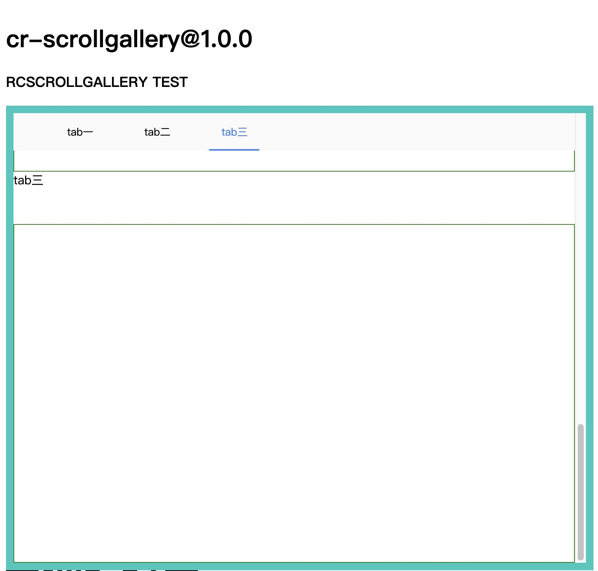

# cr-scrollgallery
---

react component

## Example


## Usage

```jsx
cnpm install --save cr-scrollgallery
```

```js
import ScrollGallery from 'cr-scrollgallery'
import 'cr-scrollgallery/assets/index.css'
// 注意在使用的时候不能忘记引入css
  render () {
    const galleryTop = (
      <div style={{border: '1px solid red', height: 300}}></div>
    )
    const arrayElement = () => {
      const one = (
        <div key='one'>
          <div style={{ height: 80}}>tab一</div>
          <div style={{border: '1px solid green', height: 450}}></div>
        </div>
      )
      const two = (
        <div key='two'>
          <div style={{ height: 60}}>tab二</div>
          <div style={{border: '1px solid green', height: 450}}></div>
        </div>
      )
      const three = (
        <div key='three'>
          <div style={{ height: 70}}>tab三</div>
          <div style={{border: '1px solid green', height: 450}}></div>
        </div>
      )

      return [one, two, three]
    }

    return (
      <div>
        <div style={{height: 600, border: '10px solid #21c8be'}}>
          <ScrollGallery
            barTab={['tab一', 'tab二', 'tab三']}
            tabSelect={3}
            galleryTop={galleryTop}
            galleryElements={arrayElement()}
          />
        </div>
      </div>
    )
  }

```

## API
name | type | description
-----|------|------------
barTab|array|标题tab
tabSelect|number|默认选中的tab,并且滚动到相应位置
galleryTop|react node|tab bar上部内容
galleryElements|array of react node|tab对应的页面内容

## Development

```
npm install
npm start
```

## Example

http://localhost:8020/examples/testOne.html


## License

cr-scrollgallery is released under the MIT license.
